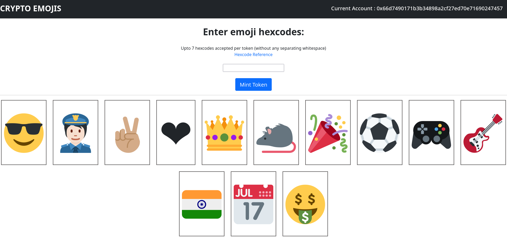

## About

This project is an implementation of [OpenZeppelin's ERC-721 token standard](https://github.com/OpenZeppelin/openzeppelin-contracts/tree/master/contracts/token/ERC721) that allows the user to mint emojis (or combination of emojis) as Non-Fungible Tokens (NFTs) on Ethereum's [Goerli test network](https://goerli.net/).

NOTE: The tokens get minted **from** the minter's (user's) address and **to** the contract address. No further ownership transfer takes place.

## Project screenshot

## Steps to mint

* Visit the project website
* Connect your Ethereum wallet (Metamask) to the website (make sure that the Goerli testnet is selected)
* Enter the hexcode of the emoji(s) that you'd want to mint (the hexcode reference on the site can be used)
* Spend Goerli fake ethers as gas fee to complete the transaction
* See the emoji(s) come to life as an NFT!

## To-do

* Website ain't currently responsive for different screen sizes
* Include other formats of emoji hexcodes
* Frontend can be bettered (loop display takes time)
* Mainnet deployment with a proper project format

- [Etherscan preview](https://goerli.etherscan.io/address/0x7855FDe3621861f58635cB76D27006d3A8D584D6)
- [OpenSea preview](https://testnets.opensea.io/collection/crypto-emoji-v2)
- [Rinkeby Etherscan previw](https://rinkeby.etherscan.io/address/0xcCdfC5839E27ad509264719e87b562d1Fc32B104) (old deprecated contract)

